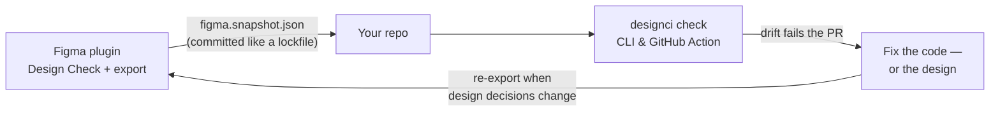

# Design CI

**CI for your design system.** Catch design drift between Figma and production
before it ships.

Design CI compares a design system's stated definitions — Figma variables and
styles — against what production actually ships: design tokens, CSS custom
properties, Tailwind config. Drift becomes a violation, violations fail a check,
and the check runs where the work happens.

Deterministic rules, no AI in the check path.

## The loop



A designer exports the design system's *stated* decisions from Figma; the
snapshot lives in the repo next to the code that ships them; every PR compares
the two. When they disagree, someone decided something once and wrote it down
twice — the check makes that visible before it ships.

| Piece | Where |
| --- | --- |
| Engine (`@designci/core`) | [`packages/core`](./packages/core) — domain, normalization, rules, runner, adapters ([npm](https://www.npmjs.com/package/@designci/core)) |
| CLI (`designci`) | [`packages/cli`](./packages/cli) — `npx designci check`, exit codes 0/1/2 ([npm](https://www.npmjs.com/package/designci)) |
| Figma plugin | [`packages/figma-plugin`](./packages/figma-plugin) — Design Check + snapshot export |
| GitHub Action | [Design CI Check](https://github.com/marketplace/actions/design-ci-check) — PR annotations (source of truth in [`action/`](./action)) |
| Demo | [`usedesignci/demo`](https://github.com/usedesignci/demo) — a seeded-drift app to try the whole loop |

## Documentation

The full guides live in [`docs/`](./docs):
[getting started](./docs/getting-started.md) ·
[the Figma plugin](./docs/figma-plugin.md) ·
[configuration](./docs/configuration.md) ·
[the CLI & baselines](./docs/cli.md) ·
[rules](./docs/rules.md) ·
[the GitHub Action](./docs/github-action.md)

## See it work first

The fastest way to understand Design CI is a repo where the drift is already
seeded: clone [`usedesignci/demo`](https://github.com/usedesignci/demo), run
`npx designci check`, and read the three failures it was built to have. Then
wire up your own project.

## Set up your own project

It takes one designer and one engineer, about five minutes each.

**The designer, in the design-system Figma file:**

1. Run the **Design CI** plugin. *Scan* lints the canvas and checks tokens with
   no setup at all — raw colors (with the matching token named), off-scale
   spacing and radii, detached instances, WCAG text contrast.
2. Hit **Export snapshot** and hand `figma.snapshot.json` to whoever owns the
   repo. That file is the design side of the conversation.

Or skip the handoff: connect the repo once in the plugin's Settings (owner/repo
plus a fine-grained token scoped to just that repository) and the Home tab shows
whether the repo's copy is current — when it's behind, one click commits the
snapshot to a `design-ci/snapshot` branch and opens (or refreshes) a pull
request, where the check runs. The plugin stays offline otherwise: the only
network call it can ever make is to api.github.com, when you push.

**The engineer, in the repo:**

```bash
mkdir -p design && mv ~/Downloads/figma.snapshot.json design/
npx designci init     # detects sources, proposes token mappings, you confirm
npx designci check    # compares design against code, exits 1 on drift
```

`init` is a wizard: it finds your token sources (CSS custom properties, tokens
JSON, a resolved Tailwind theme), proposes mappings where values agree —
Tailwind stock defaults batched separately from your own decisions — and
surfaces name-aligned pairs whose values *disagree*: confirming one of those
hands you your first real drift before setup is even done. Nothing is written
without your yes; the check never guesses a mapping on its own. And it ends by
offering to accept today's drift into the baseline — so setup finishes with a
green check that fails only on drift introduced *after* it.

```
Design CI — Acme

  ✓ 48 of 50 tokens clean

  ✕ radius.lg  src/styles/tokens.css:32
    radius.lg is 6px in src/styles/tokens.css but 8px in Figma
      wrote:    6px
      expected: 8px
      fix: Set radius.lg to 8px

  Design health: 95%

  1 error, 5 warnings, 0 info
```

**Already drifted?** Of course you are — every real system is.
`designci check --update-baseline` accepts the current state so CI starts
green and fails only on *new* drift; the accepted violations still count
against the health score, so the number tells the truth while you pay the
backlog down.

**Then put it on every PR:**

```yaml
# .github/workflows/design-ci.yml
name: Design CI
on: pull_request
permissions:
  contents: read
  checks: write
jobs:
  check:
    runs-on: ubuntu-latest
    steps:
      - uses: actions/checkout@v4
      - uses: usedesignci/designci-action@v1
```

**Keeping it honest:** when design decisions change, the designer re-exports
and the snapshot changes in a PR like any other code. The CLI nudges when a
committed snapshot is more than 30 days old, so a stale copy of Figma doesn't
quietly green-light old truth.

## What the engine does today

```ts
import { allRules, runCheck } from '@designci/core'

const result = runCheck({ snapshots, rules: allRules, config })

result.health.overall  // 97
result.counts          // { error: 1, warn: 2, info: 0, total: 3 }
result.violations      // sorted, deterministic, JSON-stable
```

Each source — a Figma export, a tokens file, a stylesheet — becomes a
`DesignSystemSnapshot`. Rules read snapshots and emit findings; the runner
attaches severity from config, applies any baseline, sorts, and scores.

Config is written as policy plus explicit mappings:

```json
{
  "rules": { "token-value-mismatch": "error", "duplicate-token": "warn" },
  "mappings": [
    { "figma": "radius.lg", "css": "--radius-lg" }
  ]
}
```

Core validates that document but never reads it off disk — `parseConfig` and
`parseBaseline` take an already-decoded value. The CLI does the file I/O; the
Figma plugin has no filesystem and parses the same formats from plugin storage.

### Real sources, read as they are written

Three adapters turn source formats into snapshots:

- **Tokens JSON** — the W3C Design Tokens format, with `$type` inherited from
  groups, plus the unprefixed `value`/`type` spelling Style Dictionary and Tokens
  Studio still emit.
- **CSS** — custom properties, found wherever they are declared. Declarations
  inside `@media`, `@supports` or `@container` are reported and skipped: a
  dark-theme override is a different *mode* of a token, not its default, and
  comparing it against a light design variable would manufacture drift.
- **Tailwind** — a resolved theme object (`resolveConfig(config).theme`), with
  each scale typed from Tailwind's own schema. `fontSize: ['1rem', '1.5rem']` is
  read as a type ramp, not a length.

A format that declares types is believed. Where none is declared, the type comes
from the value's syntax: `--radius-lg: 8px` is a length because `8px` parses as
one, not because of what the property is called.

### Values are compared, never strings

`#FF6B00` and `rgb(255 107 0)` are one colour. `1rem` and `16px` are one length.
`0.15s` and `150ms` are one duration. An object shadow from Figma and a CSS
shadow string are one shadow. Everything routes through `normalize/` first,
because a linter that cries wolf on a spelling difference gets switched off.

Values that cannot be resolved — `currentColor`, `calc()`, an unsupported colour
space — are marked unnormalized with a reason and skipped, never guessed at.

### Equivalence is declared, never inferred

The engine will not decide that `color/brand/primary` means `--color-primary`.
Cross-source relationships come from explicit mappings in config. A design token
with no mapping is reported as unmapped, which is a fact; guessing at a match
would produce a confident report about a relationship nobody stated.

### Adoption does not start with a red build

A real design system has years of accumulated drift, so failing the first build
on all of it just gets the tool removed. A baseline records the current state as
accepted; CI then fails only on drift introduced *after* it.

A baseline suppresses the failure, not the drift. Accepted violations stay in the
result and still count against the health score, so the dashboard keeps telling
the truth and the number improves only when the system does. Entries that stop
matching are reported as stale, so a fixed drift cannot silently come back.

### Runs are reproducible

Rules are pure functions of their context — no file access, no network, no
clock, no randomness. The runner imposes a total order on violations, so
identical inputs serialize to byte-identical JSON. That is what makes results
usable as baselines, cache keys, and diffable CI artifacts.

## Development

```bash
pnpm install
pnpm typecheck
pnpm test
```

Node 22, pnpm 9+.

`packages/core/src/fixtures/small-system.ts` is the shared test corpus: a
25-token system in a Figma variant and a CSS variant, agreeing on values while
disagreeing on notation almost everywhere, with three drifts seeded — one value
mismatch, one missing token, one duplicate. Downstream milestones test against
it rather than inventing new data.

## License

Apache-2.0. See [LICENSE](./LICENSE).
