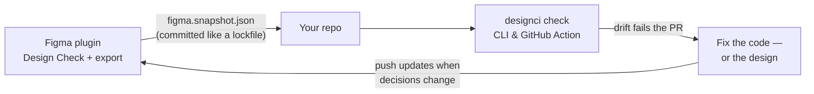

# Design CI documentation

**CI for your design system.** Design CI compares the design system's stated
decisions — Figma variables and styles, exported as a snapshot — against what
production ships: CSS custom properties, tokens JSON, a Tailwind theme. When
they disagree, a pull request goes red *before* the drift ships.

## Guides

| Page | What it covers |
| --- | --- |
| [Getting started](./getting-started.md) | The full setup, five minutes for a designer and five for an engineer |
| [The Figma plugin](./figma-plugin.md) | Design Check, auto-fix, promoting values to variables, repo sync, snapshot export |
| [Configuration](./configuration.md) | `designci.config.json`: sources, rules, severities, mappings |
| [The CLI](./cli.md) | `designci init` and `check`, baselines, exit codes, JSON output |
| [Rules](./rules.md) | Every check, why it matters, and how to fix each finding |
| [The GitHub Action](./github-action.md) | Running the check on every pull request |

## The ideas underneath

A few principles explain most of Design CI's behavior:

- **Green is the happy path.** Setup ends with a baseline that accepts
  today's drift, so CI is green from day one and red always means *something
  changed since we agreed* — never "you have homework from before you
  installed the tool." Accepted drift still counts against the health score:
  the baseline suppresses the failure, never the truth.
- **Values are compared, never strings.** `#FF6B00` and `rgb(255 107 0)` are
  one color; `1rem` and `16px` are one length. A linter that cries wolf on a
  spelling difference gets switched off.
- **Equivalence is declared, never inferred.** The engine will not decide
  that `color/brand/primary` means `--color-primary`. Tools *propose* —
  mappings in the init wizard, names when promoting a value to a variable —
  and a human confirms. Nothing is written without a yes.
- **Deterministic, no AI in the check path.** Identical inputs produce
  byte-identical results. The check never touches the network; the plugin's
  only network use is the optional [repo sync](./figma-plugin.md#repo-sync),
  and only when you push.

## Try it in 30 seconds

Clone [usedesignci/demo](https://github.com/usedesignci/demo), run
`npx designci check`, and watch it fail for the right reasons — three drifts
are seeded on purpose.
